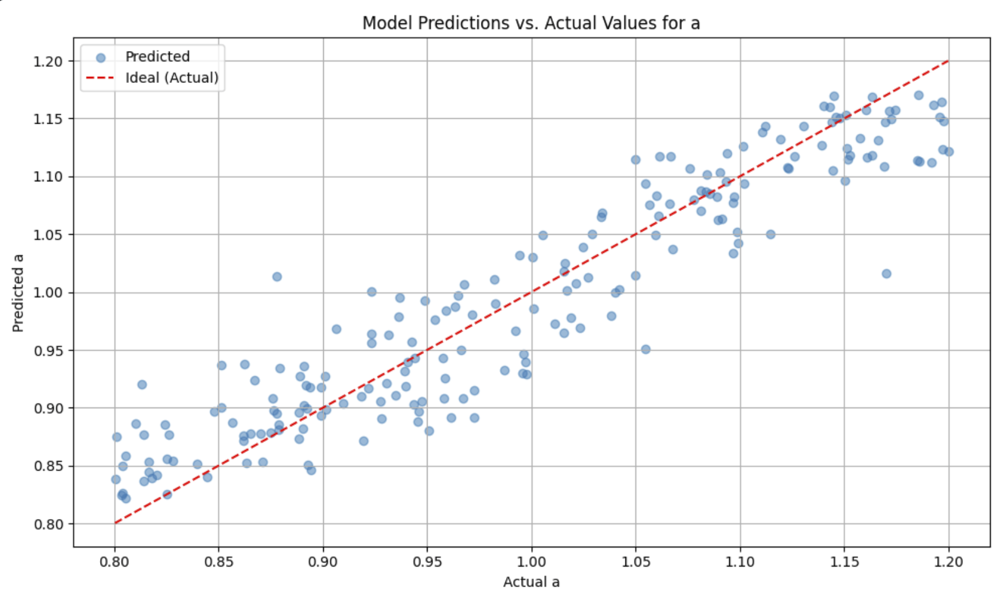
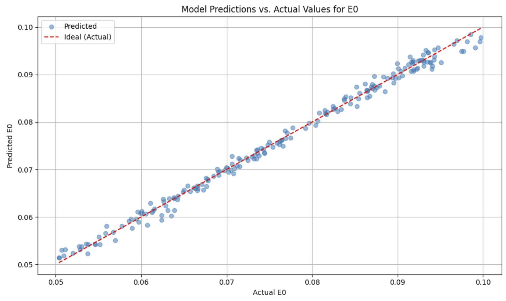
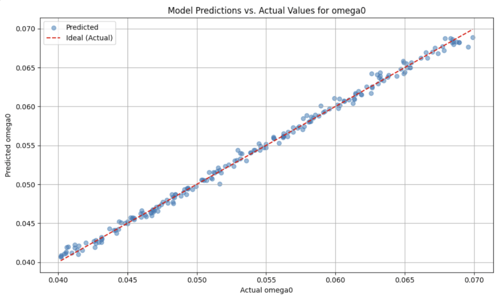
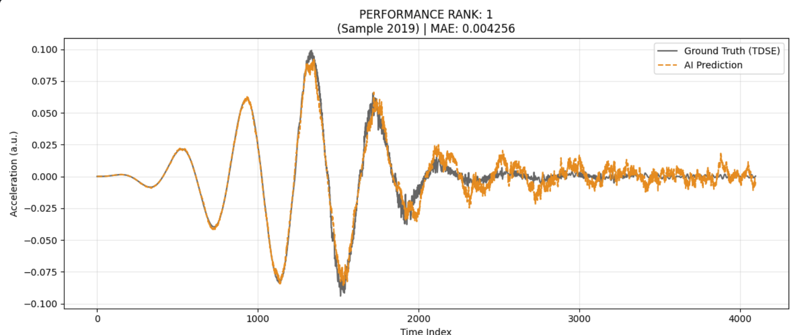
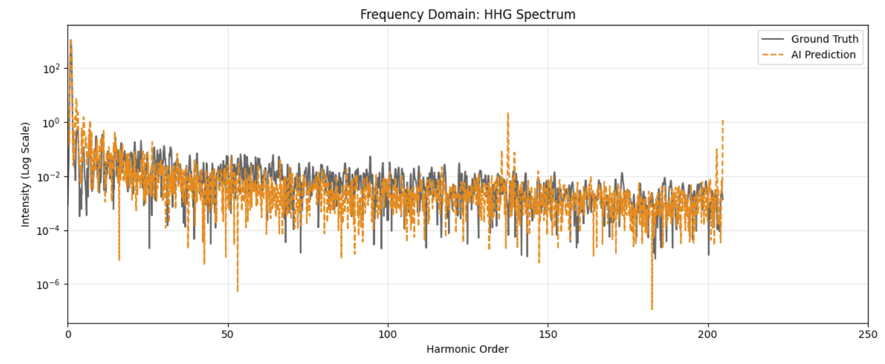
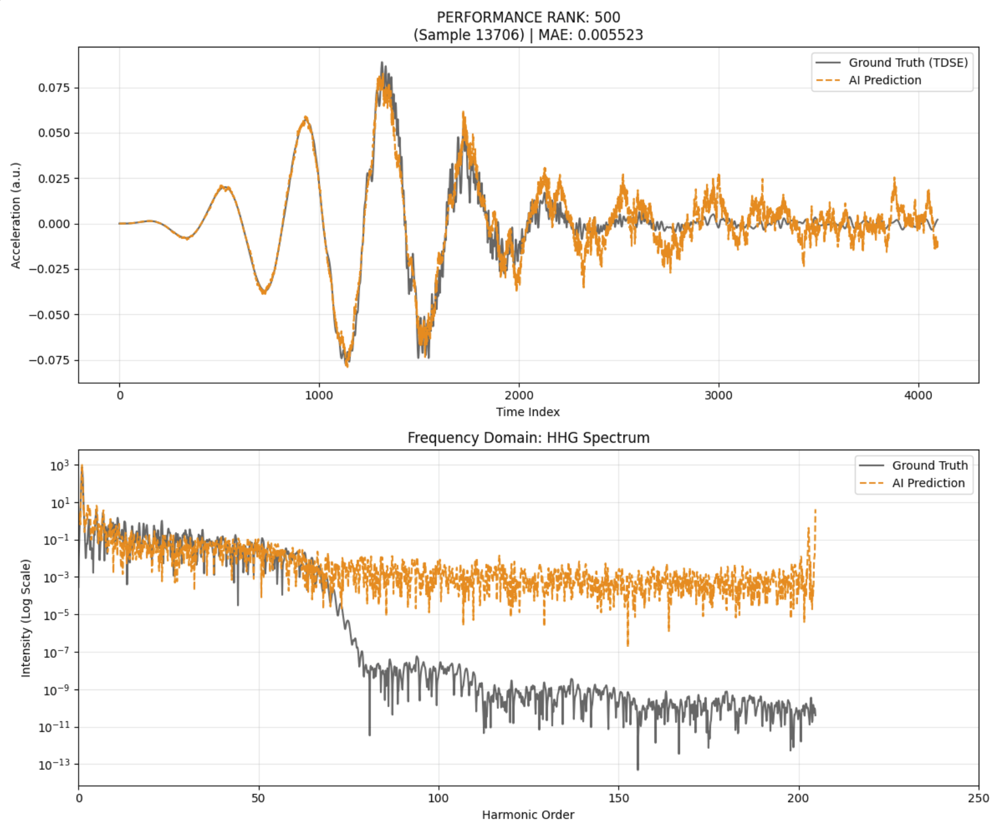
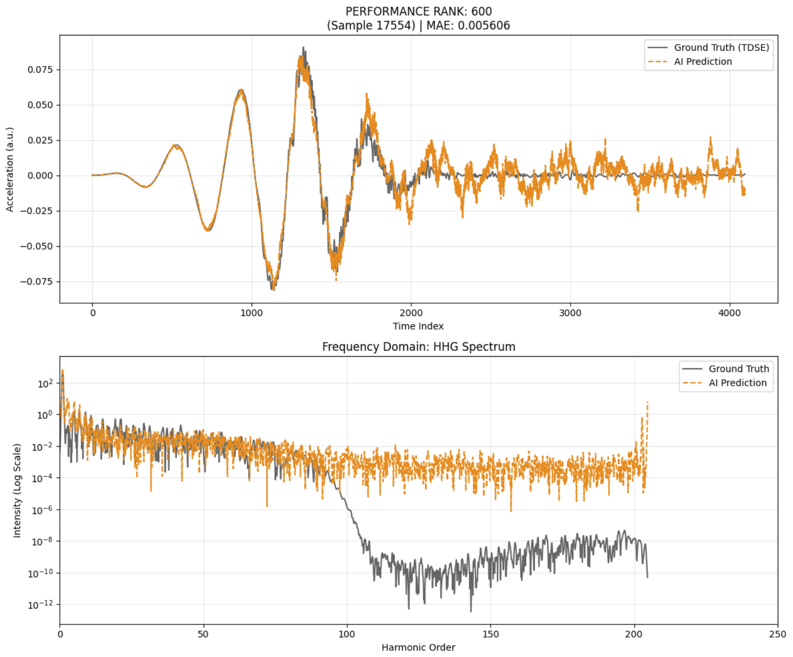

---

##  Summary

This project develops a  machine learning framework for High Harmonic Generation (HHG) spectroscopy. The workflow consists of three interconnected components:  Crank-Nicolson TDSE solver for generating accurate ground truth HHG spectra,  a Random Forest classifier for inferring laser parameters from experimental spectra, and  a Deep Neural Network for spectrum prediction given laser parameters. 

---

## 1. Introduction

### 1.1 Scientific Background

High Harmonic Generation is a  optical process where an intense infrared laser pulse interacts with an atomic gas, producing  radiation at integer multiples of the fundamental laser frequency. The resulting spectrum encodes  information about the driving laser parameters (intensity, wavelength, pulse envelope) and the underlying atomic dynamics.

### 1.2 Project Objectives

The primary objectives are:

1. **Develop an accurate TDSE solver** using implicit time integration (Crank-Nicolson) to  simulate HHG dynamics
2. **Train an inverse ML model** (Random Forest) to infer laser parameters from experimental HHG spectra
3. **Train a forward ML model** (Deep Neural Network) to rapidly generate spectra given laser parameters

---

## 2. Theoretical Framework

### 2.1 Time-Dependent Schrödinger Equation

The 1D TDSE in the length gauge is:

$$i\frac{\partial \psi}{\partial t} = \hat{H}(t) \psi = \left[ -\frac{1}{2}\frac{d^2}{dx^2} + V(x) + xE(t) \right] \psi$$

where:

- $\psi(x,t)$ is the electronic wavefunction
- $V(x)$ is the atomic potential (soft-Coulomb)
- $E(t)$ is the laser electric field
- Atomic units are used throughout ($\hbar = m_e = e = 1$)

### 2.2 Soft-Coulomb Potential

To avoid singularities at the origin, we use:

$$V(x) = -\frac{1}{\sqrt{x^2 + a^2}}$$

where $a$ is a softening parameter (typically 0.8–1.5 a.u.). This approximates the effective potential seen by an active electron.

### 2.3 Laser Field Parameterization

The electric field is modeled as:

$$E(t) = E_0 \cdot \text{envelope}(t) \cdot \sin(\omega t)$$

with a sin²-envelope for smooth onset/offset:

$$\text{envelope}(t) = \begin{cases} \sin^2\left(\frac{\pi t}{T_{\text{pulse}}}\right) & 0 \leq t \leq T_{\text{pulse}} \ 0 & \text{otherwise} \end{cases}$$

### 2.4 High Harmonic Spectrum and Cutoff

The dipole acceleration $a(t) = -\langle \frac{dV}{dx} \rangle - E(t)$ is computed via the Ehrenfest theorem and Fourier-transformed to obtain the spectrum. 

---

## 3. Methodology

## Part I: TDSE Simulation Core Using Crank-Nicolson

### 3.1 Crank-Nicolson Method

The Crank-Nicolson scheme is an implicit, second-order accurate time integration method that discretizes the TDSE as:

$$\left(1 + i\frac{\Delta t}{2}\hat{H}^{n+1/2}\right)\psi^{n+1} = \left(1 - i\frac{\Delta t}{2}\hat{H}^{n+1/2}\right)\psi^n$$

or equivalently:

$$\psi^{n+1} = \left(1 + i\frac{\Delta t}{2}\hat{H}^{n+1/2}\right)^{-1} \left(1 - i\frac{\Delta t}{2}\hat{H}^{n+1/2}\right)\psi^n$$


### 3.2 Implementation Strategy

#### 3.2.1 Spatial Discretization

The spatial domain $[-L, L]$ is discretized into $N$ points with spacing $\Delta x = 2L/N$. The kinetic operator $-\frac{1}{2}\frac{d^2}{dx^2}$ is approximated using **finite differences**:

$$\frac{d^2\psi}{dx^2} \approx \frac{\psi_{i+1} - 2\psi_i + \psi_{i-1}}{(\Delta x)^2}$$

This creates a **tridiagonal Hamiltonian matrix** $\hat{H}$, enabling efficient sparse linear algebra.

#### 3.2.2 Temporal Discretization

At each time step:

1. **Assemble matrices:**
    - $A = 1 + i\frac{\Delta t}{2}\hat{H}^{n+1/2}$ (advances state)
    - $B = 1 - i\frac{\Delta t}{2}\hat{H}^{n+1/2}$ (right-hand side)
2. **Compute RHS:** $b = B\psi^n$
    
3. **Solve linear system:** $A\psi^{n+1} = b$ 
    
### 3.4 Computational Efficiency

For typical runs (4096 points, 10 cycles, $\Delta t = 0.05$), computation is ~5–10 seconds per simulation.

---

## Part II: Predicted Laser Parameters Using Random Forest Algorithm

### 4.1 Inverse Problem Formulation

Given an observed HHG spectrum, infer the laser parameters that produced it:

$$\text{Spectrum Features} \xrightarrow{\text{ML Model}} \text{Laser Parameters } (E_0, \omega)$$

This is the **inverse problem**: observables → causes.

### 4.2 Feature Engineering

#### 4.2.1 Spectrum Feature Extraction

From each HHG spectrum, extract five key features that correlate with laser parameters:

1. **Harmonic Cutoff Order** ($n_c$):
    
    - Highest harmonic index with intensity above noise threshold
2. **Plateau Intensity Mean** ($\langle I_{\text{plateau}} \rangle$):
    
    - Average intensity in harmonic range 5–15
3. **Individual Harmonic Intensities** ($I_5, I_{11}, I_{21}$):
    
    - Peak intensity at specific harmonic orders
    - Encode detailed spectral structure

#### 4.2.2 Log-Scaling Critical Step

log-transform all intensity features:

$$I_{\text{log}} = \log_{10}(I + \epsilon)$$

where $\epsilon = 10^{-30}$ prevents underflow. This compresses the dynamic range and makes the ML algorithm treat weak high-order harmonics as important.

### 4.3 Random Forest Model

#### 4.3.1 Algorithm Selection

Random Forest was chosen because:

- **Non-parametric:** No assumptions about feature-parameter relationships
- **Multi-output:** Simultaneously predicts $E_0$ , $\omega$ and  $a$ in a single model
- **Robust to noise:** Ensemble of trees reduces variance

#### 4.3.2 Model Architecture

```python
RandomForestRegressor(
    n_estimators=200,      
    max_depth=15,          
    random_state=42,       
    n_jobs=-1              
)
```

**Training Configuration:**

- **Input features (X):** cutoff_order, plateau_intensity_mean, H5_intensity, H11_intensity, H21_intensity
- **Output targets (y):** E0, omega0, a
- **Training set:** 80% of ~1000 simulated spectra
- **Test set:** 20% held-out for validation

#### 4.3.3 Model Performance

After training on synthetic TDSE data:




---

## Part III: Modeled HHG Spectrum Using a Deep Neural Network

### 5.1 Forward Problem Formulation

Given laser parameters, predict the resulting HHG spectrum:

$$\text{Laser Parameters } (E_0, \omega, a) \xrightarrow{\text{DNN}} \text{Spectrum}$$

This is the forward problem: rapidly synthesize spectra without running expensive TDSE simulations.

### 5.2 Neural Network Architecture

#### 5.2.1 Layers

A fully connected deep network was chosen:

- **Input dimension:** 3 (laser parameters: $E_0$, $\omega$, softening parameter $a$)
- **Output dimension:** 4096 
- **Intermediate layers:** 512 hidden units each

```python
# 1. Input Layer 
inputs = Input(shape=input_shape) 
# 2. Hidden Layers  
x = layers.Dense(512, activation='relu')(inputs) 
x = layers.BatchNormalization()(x)
x = layers.Dense(1024, activation='relu')(x) 
x = layers.BatchNormalization()(x)
x = layers.Dense(2048, activation='relu')(x)  
x = layers.BatchNormalization()(x)
# Dropout layer
x = layers.Dropout(0.1)(x)  


outputs = layers.Dense(4096, activation='linear')(x) 


model = models.Model(inputs=inputs, outputs=outputs, name="Simple_HHG_DNN")
```


#### 5.2.3 Batch Normalization and Dropout

- **BatchNormalization:** Normalizes activations between layers, stabilizes training, acts as implicit regularizer
- **Dropout(0.1):** Light regularization (10% dropout rate) prevents overfitting while maintaining capacity


### 5.4 Results






### 5.3 Conclusion

Standard MSE loss fails for HHG spectra because:

- Intensities span 15 orders of magnitude
- MSE dominates on large-amplitude features, ignoring the subtle high-order harmonics
- The cutoff structure  becomes invisible to the loss function